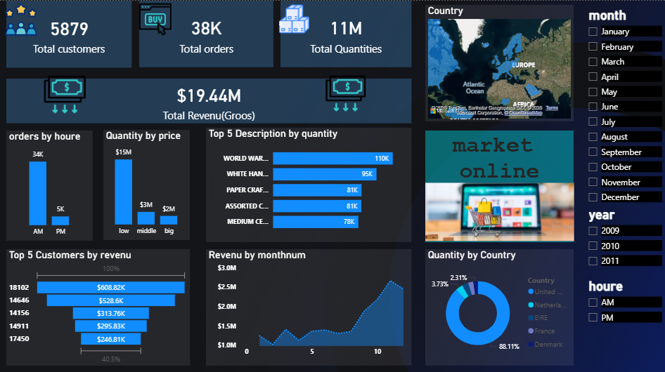
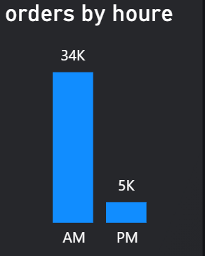
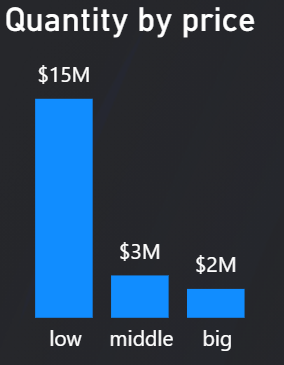
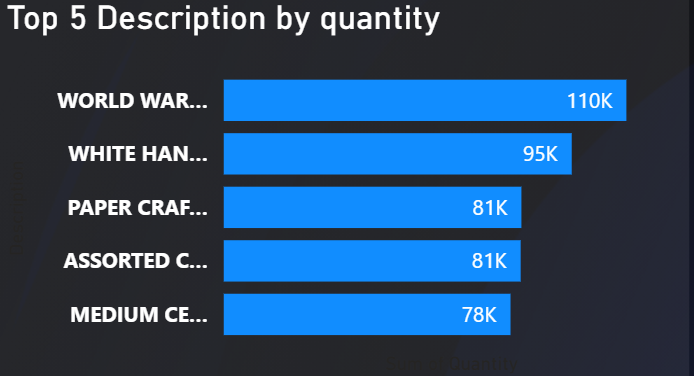
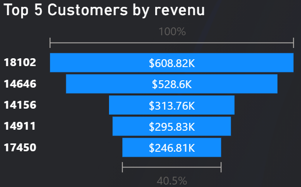
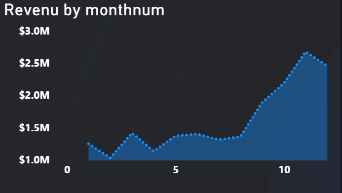
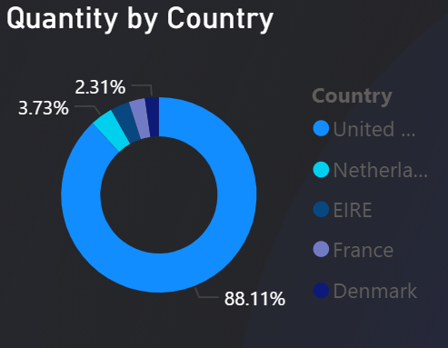

# market_Online_data_analysis
data analysis project using powerbi to explore market online 
## Data source :
from kaggel 
## Data set :
link : https://www.kaggle.com/datasets/lakshmi25npathi/online-retail-dataset
## Tools used :
Power Bi
## Project Question : 
What factors influence sales performance and customer purchasing behavior in the online retail business ??
## Explore data :
the data contains 541911 rows and 8 columns 
## Clean data :
1-unimportant columns were removed from the analysis 

2-removed errors 

3-removed duplicate data 

4-each column was converted to a number , data or text format depending on the column and its contents

5-prepared the dataset for analysis 
## data analysis :

                                                         Dashboard

We notice that orders are lower in the morning than in the evening

We notice that quantities ordered at low prices are significantly higher than others.
                      

These are the top 5 most requested products

These are the top 5 customers in the market.

We notice that revenue increases in the last five months of the year

We notice a clear difference in purchase quantities in the United States compared to other countries.
